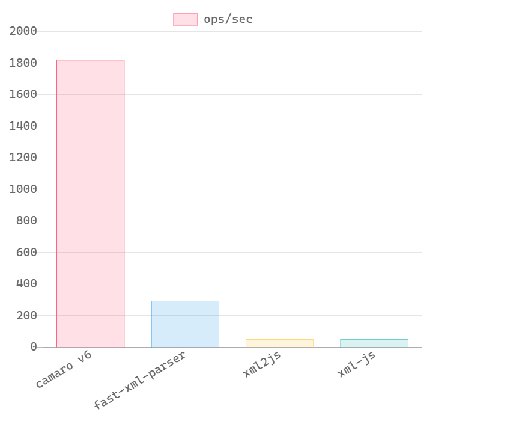
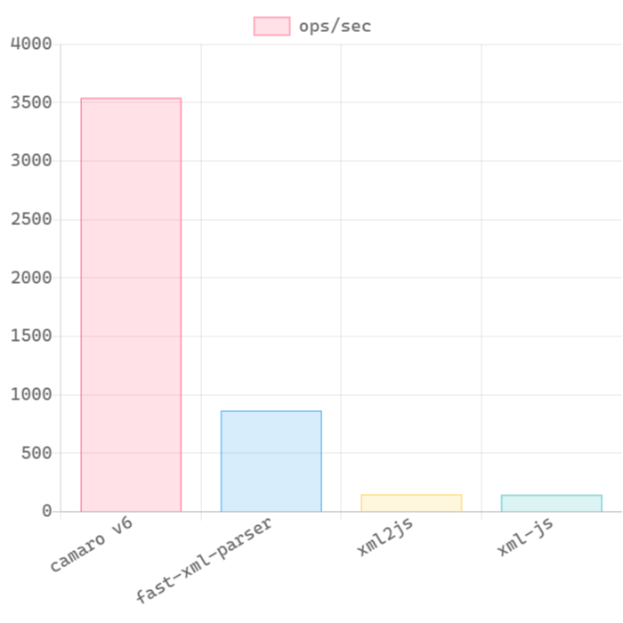
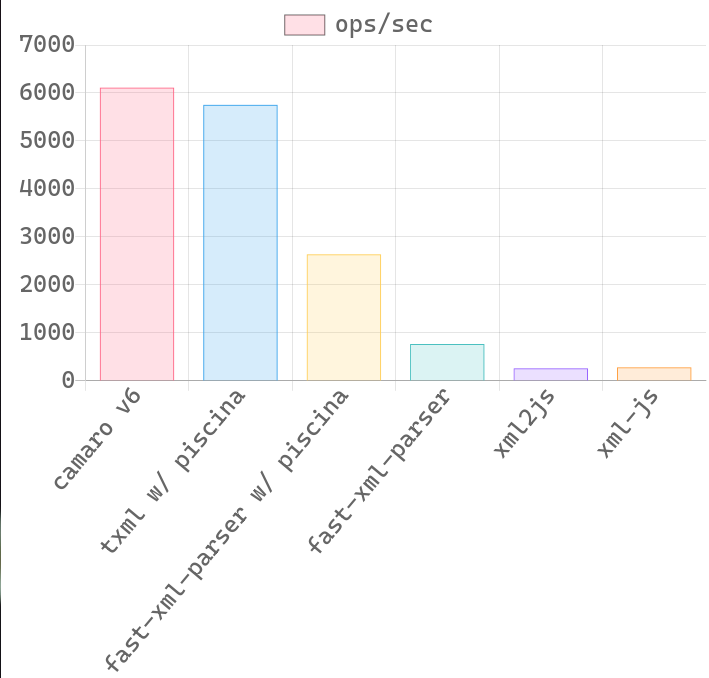
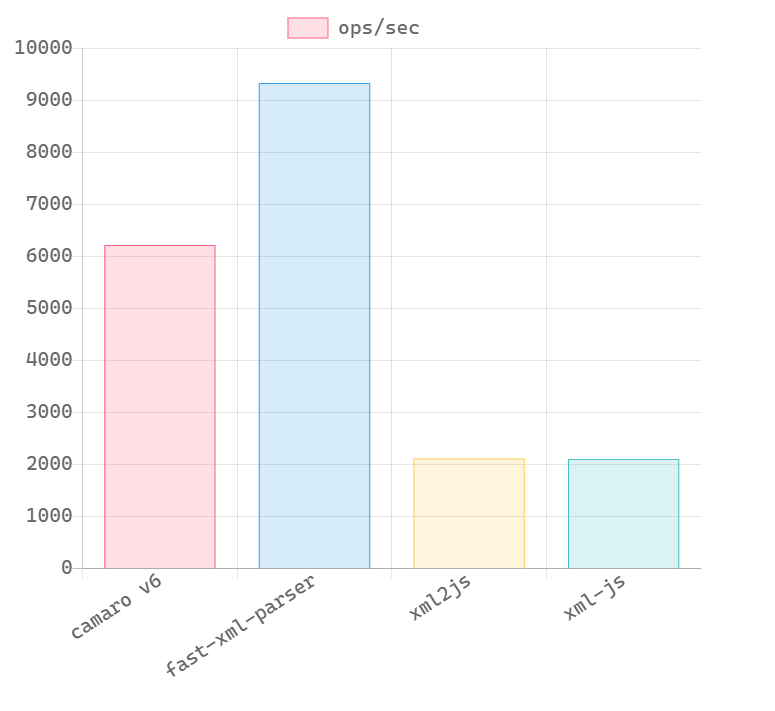
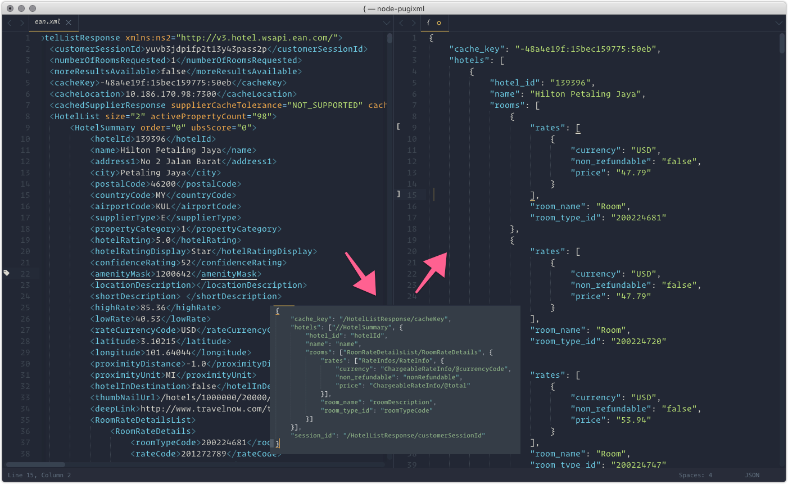

# camaro

> camaro is an utility to transform XML to JSON, using Node.js binding to native XML parser [pugixml](http://pugixml.org/), one of the fastest XML parser around.

[](https://npm.im/camaro)

[](https://npm.im/camaro)
[](https://npm.im/camaro)

## 🤘 Features

* Transform XML to JSON.
    * Only take properties that you're interested in.
    * Output is a ready to use JS object.
    * For those that need a complete document parser, checkout my other project [@tuananh/sax-parser](https://github.com/tuananh/sax-parser) - a pretty fast native module, XML-compliant SAX parser for Node.js.

* Written in C++ and compiled down to WebAssembly so no re-compilation needed.
    * No need to build binary whenever a new Node version released.
    * Work on all major platforms (OS X, Linux and Windows). See Travis CI and AppVeyor build status for details.
    * AWS Lambda friendly (or serverless in general).

* It's pretty fast on large XML strings.
    * We're using [pugixml](http://pugixml.org/) underneath. It's one of the fastest XML parser around.
    * Scale well with multi-core processor by use of `worker_threads` pool (Node >= 12).

* Pretty print XML.

## 🔥 Benchmark

300 KB XML file                      |  100 KB XML file
:-----------------------------------:|:-------------------------:
    |  

60 KB XML file                       |  7 KB XML file
:-----------------------------------:|:-------------------------:
     |  

XML file is an actual XML response from Expedia API. I just delete some nodes to change its size for benchmarking.

For complete benchmark, see [benchmark/index.md](benchmark/index.md).

* Please note that **this is an unfair game for camaro** because it only transform those fields specified in template.
The whole reason of me creating this is because most of the time, I'm just interested in some of the data in the whole XML mess.
* I may expose another method to transform the whole XML tree so that the benchmark will better reflect the real performance.
* 🚧 Performance on small XML strings will probably be worse than pure JavaScript implementation. If your use cases consist of small XML strings only, you probably don't need this.
* Some other libraries that I used to use for benchmark like `rapidx2j` or `xml2json` no longer works on Node 14 so I remove them from the benchmark.



## Installation

```sh
yarn add camaro
# npm install camaro
```

## Usage

You can use our custom template format powered by [XPath](https://developer.mozilla.org/en-US/docs/Web/XPath).

We also introduce some custom syntax such as:

* if a path start with `#`, that means it's a constant. E.g: `#1234` will return `1234`
* if a path is empty, return blank
* Some string manipulation functions which are not availble in XPath 1.0 such as `lower-case`, `upper-case`, `title-case`, `camel-case`, `snake-case`, `string-join` or `raw`. Eventually, I'm hoping to add all XPath 2.0 functions but these are all that I need for now. PRs welcome.

The rest are pretty much vanilla XPath 1.0.

For complete API documentation, please see [API.md](API.md)

Additional examples can be found in the examples folder at https://github.com/tuananh/camaro/tree/develop/examples.

```js
const { transform, prettyPrint } = require('camaro')

const xml = `
    <players>
        <player jerseyNumber="10">
            <name>wayne rooney</name>
            <isRetired>false</isRetired>
            <yearOfBirth>1985</yearOfBirth>
        </player>
        <player jerseyNumber="7">
            <name>cristiano ronaldo</name>
            <isRetired>false</isRetired>
            <yearOfBirth>1985</yearOfBirth>
        </player>
        <player jerseyNumber="7">
            <name>eric cantona</name>
            <isRetired>true</isRetired>
            <yearOfBirth>1966</yearOfBirth>
        </player>
    </players>
`

/**
 * the template can be an object or an array depends on what output you want the XML to be transformed to.
 * 
 * ['players/player', {name, ...}] means that: Get all the nodes with this XPath expression `players/player`.
 *      - the first param is the XPath path to get all the XML nodes.
 *      - the second param is a string or an object that describe the shape of the array element and how to get it.
 * 
 * For each of those XML node
 *      - call the XPath function `title-case` on field `name` and assign it to `name` field of the output.
 *      - get the attribute `jerseyNumber` from XML node player
 *      - get the `yearOfBirth` attribute from `yearOfBirth` and cast it to number.
 *      - cast `isRetired` to true if its string value equals to "true", and false otherwise.
 */

const template = ['players/player', {
    name: 'title-case(name)',
    jerseyNumber: '@jerseyNumber',
    yearOfBirth: 'number(yearOfBirth)',
    isRetired: 'boolean(isRetired = "true")'
}]

;(async function () {
    const result = await transform(xml, template)
    console.log(result)

    const prettyStr = await prettyPrint(xml, { indentSize: 4})
    console.log(prettyStr)
})()
```

Output of `transform()`

```
[
    {
        name: 'Wayne Rooney',
        jerseyNumber: 10,
        yearOfBirth: 1985,
        isRetired: false,
    },
    {
        name: 'Cristiano Ronaldo',
        jerseyNumber: 7,
        yearOfBirth: 1985,
        isRetired: false,
    },
    {
        name: 'Eric Cantona',
        jerseyNumber: 7,
        yearOfBirth: 1966,
        isRetired: true,
    }
]
```

And output of `prettyPrint()`

```
<players>
    <player jerseyNumber="10">
        <name>Wayne Rooney</name>
        <isRetired>false</isRetired>
        <yearOfBirth>1985</yearOfBirth>
    </player>
    <player jerseyNumber="7">
        <name>Cristiano Ronaldo</name>
        <isRetired>false</isRetired>
        <yearOfBirth>1985</yearOfBirth>
    </player>
    <player jerseyNumber="7">
        <name>Eric Cantona</name>
        <isRetired>true</isRetired>
        <yearOfBirth>1966</yearOfBirth>
    </player>
</players>
```

## Similar projects

- [cruftless](https://github.com/wspringer/cruftless): I personally find this project very fascinating. Its template engine is more powerful than camaro's XPath-based perhaps. You should check it out.

## Used by

- https://github.com/dsifford/academic-bloggers-toolkit
- https://github.com/hexojs/hexo-generator-sitemap
- https://github.com/hexojs/hexo-generator-feed
- https://github.com/hexojs/hexo-migrator-wordpress
- https://github.com/fengkx/NodeRSSBot

...

## Stargazers over time

[](https://starchart.cc/tuananh/camaro)

## Licence

[The MIT License](LICENSE)
