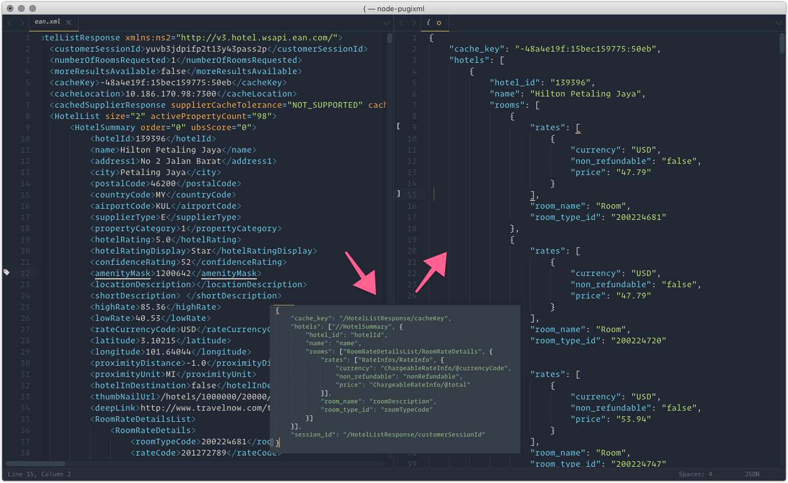

# camaro

> camaro is a Node.js library that transform XML to JSON, using Node.js bindings to a native XML parser [pugixml](http://pugixml.org/) - one of the fastest XML parsers around.

[](https://npm.im/camaro)

[](https://npm.im/camaro)
[](https://npm.im/camaro)

## 🤘 Features

* Transform XML to JSON.
    * Only take properties that you're interested in.
    * Output is ready to use JS object.

* Written in C++ and compiled down to WebAssembly, so no re-compilation needed.
    * No need to build a binary whenever a new Node version is released.
    * Works on all major platforms (OS X, Linux and Windows). See Travis CI and AppVeyor build status for details.
    * AWS Lambda friendly (or serverless in general).

* It's pretty fast on large XML strings.
    * We're using [our fork of pugixml](http://pugixml.org/) under the hood. It's one of the fastest XML parsers around.
    * Scales well with multi-core processors by use of a `worker_threads` pool (Node >= 12).

* Pretty print XML.

## 🔥 Benchmark

```
benchmark                   avg (min … max) p75 / p99    (min … top 1%)
------------------------------------------- -------------------------------
camaro v6                    263.89 µs/iter 268.38 µs  █                   
                      (233.35 µs … 1.28 ms) 490.20 µs  █                   
                    (  1.94 kb …   1.30 mb)  31.52 kb ██▇▅▄▃▂▂▁▁▁▁▁▁▁▁▁▁▁▁▁

txml                         525.44 µs/iter 492.49 µs █                    
                      (484.75 µs … 1.35 ms) 994.34 µs █                    
                    (166.54 kb …   1.43 mb) 308.04 kb █▂▁▁▁▁▂▁▁▁▁▁▁▁▁▁▁▁▁▁▁

fast-xml-parser                2.37 ms/iter   2.35 ms █                    
                        (2.27 ms … 3.78 ms)   3.66 ms █                    
                    (321.17 kb …   3.66 mb)   2.44 mb █▄▂▂▄▁▁▂▁▁▁▁▁▁▁▁▁▁▁▁▁

xml2js                         3.83 ms/iter   3.84 ms █                    
                        (3.63 ms … 5.47 ms)   5.35 ms █▃                   
                    (  1.21 mb …   3.22 mb)   1.74 mb ██▇▆▃▂▂▂▁▁▁▁▁▁▁▁▁▁▁▂▂

xml-js                         2.50 ms/iter   2.47 ms  █                   
                        (2.45 ms … 3.22 ms)   2.90 ms ▄█                   
                    ( 41.03 kb …   2.59 mb)   1.27 mb ██▃▂▂▁▁▁▁▁▁▁▁▁▁▁▂▁▁▁▁

summary
  camaro v6
   1.99x faster than txml
   8.99x faster than fast-xml-parser
   9.46x faster than xml-js
   14.52x faster than xml2js
```

The XML file is an actual XML response from the Expedia API. I just deleted some nodes to change its size for benchmarking.

For complete benchmark, see [benchmark](benchmark/).

* Please note that **this is an unfair game for camaro** because it only transforms the fields specified in the template.
The whole reason for me creating this is because most of the time, I'm just interested in some of the data in the whole XML mess.
* 🚧 Performance on small XML strings will probably be worse than pure JavaScript implementations. If your use cases consists of small XML strings only, you probably don't need this.



## Installation

```sh
pnpm add camaro
# npm install camaro
```

## Usage

You can use our custom template format powered by [XPath](https://developer.mozilla.org/en-US/docs/Web/XPath).

We also introduce some custom syntax such as:

* if a path starts with `#`, that means it's a constant. E.g, `#1234` will return `1234`
* if a path is empty, return blank
* Some string manipulation functions which are not availble in XPath 1.0, such as `lower-case`, `upper-case`, `title-case`, `camel-case`, `snake-case`, `string-join` or `raw`. Eventually, I'm hoping to add all XPath 2.0 functions but these are all that I need for now. PRs are welcome.

The rest are pretty much vanilla XPath 1.0.

For complete API documentation, please see [API.md](API.md)

Additional examples can be found in the [examples](examples/) folder or this comprehensive [blog post](https://mdleom.com/blog/2020/01/20/how-to-use-camaro-xml/) by Ming Di Leom.

```js
const { transform, prettyPrint } = require('camaro')

const xml = `
    <players>
        <player jerseyNumber="10">
            <name>wayne rooney</name>
            <isRetired>false</isRetired>
            <yearOfBirth>1985</yearOfBirth>
        </player>
        <player jerseyNumber="7">
            <name>cristiano ronaldo</name>
            <isRetired>false</isRetired>
            <yearOfBirth>1985</yearOfBirth>
        </player>
        <player jerseyNumber="7">
            <name>eric cantona</name>
            <isRetired>true</isRetired>
            <yearOfBirth>1966</yearOfBirth>
        </player>
    </players>
`

/**
 * the template can be an object or an array depends on what output you want the XML to be transformed to.
 * 
 * ['players/player', {name, ...}] means that: Get all the nodes with this XPath expression `players/player`.
 *      - the first param is the XPath path to get all the XML nodes.
 *      - the second param is a string or an object that describe the shape of the array element and how to get it.
 * 
 * For each of those XML node
 *      - call the XPath function `title-case` on field `name` and assign it to `name` field of the output.
 *      - get the attribute `jerseyNumber` from XML node player
 *      - get the `yearOfBirth` attribute from `yearOfBirth` and cast it to number.
 *      - cast `isRetired` to true if its string value equals to "true", and false otherwise.
 */

const template = ['players/player', {
    name: 'title-case(name)',
    jerseyNumber: '@jerseyNumber',
    yearOfBirth: 'number(yearOfBirth)',
    isRetired: 'boolean(isRetired = "true")'
}]

;(async function () {
    const result = await transform(xml, template)
    console.log(result)

    const prettyStr = await prettyPrint(xml, { indentSize: 4})
    console.log(prettyStr)
})()
```

Output of `transform()`

```
[
    {
        name: 'Wayne Rooney',
        jerseyNumber: 10,
        yearOfBirth: 1985,
        isRetired: false,
    },
    {
        name: 'Cristiano Ronaldo',
        jerseyNumber: 7,
        yearOfBirth: 1985,
        isRetired: false,
    },
    {
        name: 'Eric Cantona',
        jerseyNumber: 7,
        yearOfBirth: 1966,
        isRetired: true,
    }
]
```

And output of `prettyPrint()`

```
<players>
    <player jerseyNumber="10">
        <name>Wayne Rooney</name>
        <isRetired>false</isRetired>
        <yearOfBirth>1985</yearOfBirth>
    </player>
    <player jerseyNumber="7">
        <name>Cristiano Ronaldo</name>
        <isRetired>false</isRetired>
        <yearOfBirth>1985</yearOfBirth>
    </player>
    <player jerseyNumber="7">
        <name>Eric Cantona</name>
        <isRetired>true</isRetired>
        <yearOfBirth>1966</yearOfBirth>
    </player>
</players>
```

## Similar projects

- [cruftless](https://github.com/wspringer/cruftless): I personally find this project very fascinating. Its template engine is more powerful than camaro's XPath-based perhaps. You should check it out.

## Used by

- https://github.com/dsifford/academic-bloggers-toolkit
- https://github.com/hexojs/hexo-generator-sitemap
- https://github.com/hexojs/hexo-generator-feed
- https://github.com/hexojs/hexo-migrator-wordpress
- https://github.com/fengkx/NodeRSSBot

...

## Stargazers over time

[](https://starchart.cc/tuananh/camaro)

## Licence

[The MIT License](LICENSE)
