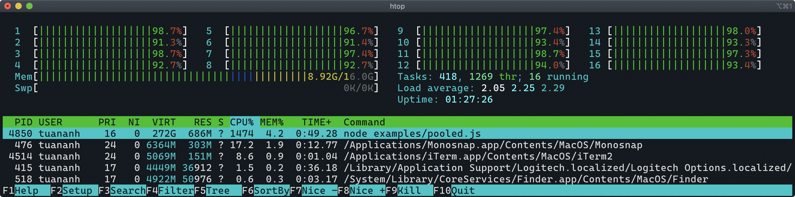

## Using worker_threads pool with `piscina`

See [pooled.js](pooled.js) for usage. This example uses `piscina` module which makes it easier to create a pool of thread workers.

Performance comparision between `pooled.js` and `unpooled.js` version

```
node examples/pooled.js                               
camaro (pooled): finished 10000 iterations in 7741.852433 ms
camaro (pooled): 1291.6805230456916 ops/sec
```

```
node examples/unpooled.js
camaro (unpooled): finished 10000 iterations in 38647.142768000005 ms
camaro (unpooled): 258.75134055912775 ops/sec
```

`htop` output of the pooled version

